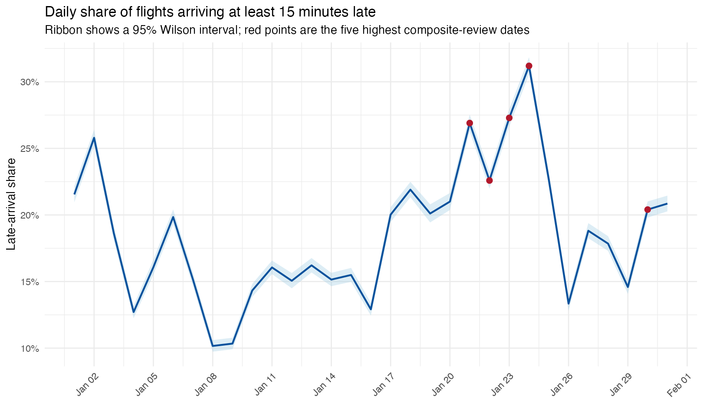

# Flight Delay Data-Quality Review

An R portfolio project that audits a 583,985-record January 2019 U.S. flight
extract and identifies dates for follow-up disruption review.

## What this project demonstrates

- schema and consistency validation;
- explicit missing-outcome analysis;
- grouped operational metrics with uncertainty intervals;
- transparent multi-metric prioritization;
- sensitivity analysis; and
- careful separation of descriptive evidence from causal claims.

## Data

The analysis uses U.S. Department of Transportation Bureau of Transportation
Statistics On-Time Performance fields. Raw data are not committed. See
[`data/README.md`](data/README.md) for fields and retrieval instructions.

## Run

From the repository root:

```bash
Rscript run.R /absolute/path/to/january_2019_flights.csv
```

This writes aggregate tables and figures to `artifacts/` and renders
`report/analysis.html`.

Required R packages:

```r
install.packages(c("data.table", "ggplot2", "knitr", "rmarkdown", "scales"))
```

## Methods

The priority score averages within-month percentile ranks for mean arrival
delay, 95th-percentile delay, the late-15 rate, the severe-60 rate, and the
post-departure worsening rate. It is an investigation queue—not a probability
that an operational failure occurred. Wilson intervals describe uncertainty in
daily late-15 rates, and leave-one-metric-out analysis checks ranking stability.

## Results

The five highest relative review scores were January 24, 23, 21, 22, and 30.
January 24 had the strongest overall profile: among flights with a known
arrival outcome, 31.2% arrived at least 15 minutes late, mean delay was 19.1
minutes, and the 95th percentile was 139 minutes. Four of the five dates remain
in the top five under every leave-one-metric-out sensitivity run; January 30 is
replaced by January 25 when the worsening-rate component is removed.

These results are investigation priorities rather than confirmed operational
failures. The rendered report explains why 18,022 missing arrival outcomes and
omitted causal fields limit interpretation.



## Portfolio context and attribution

This is an independent, shortened portfolio edition inspired by a collaborative
STA 4320 course project. It focuses on data validation and priority-date review
and does not reproduce the full team submission.

The archived contribution statement attributes Tasks 1 and 2, overall
formatting/editing, and report-interpretation corrections to Reway Du. Tasks 3
through 5 were shared among three classmates. This rewrite deliberately avoids
claiming sole authorship of those teammates' anomaly-detection work.

Before making the repository public, obtain any teammate or instructor
permission required by the course policy.

OpenAI Codex assisted with the post-course refactor, implementation,
documentation, and testing. Reway should rerun the project and be able to
explain every audit, metric, score, and limitation before presenting it as
portfolio work.

See [`CHANGES.md`](CHANGES.md) for the full revision list.
